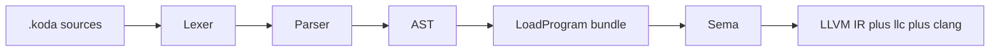

# Koda language — programmer reference and implementation map

This document is the **authoritative surface syntax** for users and an **honest map** of what the **Go + LLVM** toolchain in this repository implements today. Normative long-form design notes remain in [compiler.md](compiler.md). A **checkbox audit** of the master spec vs this repo lives in **[list.md](list.md)**. Engineering workflow and roadmap: [HANDOFF.md](HANDOFF.md).

**Commands:** `koda run` / `koda check` / `koda disasm` (prints LLVM IR) · `koda build` (LLVM IR → **llc** → object, then **Clang** + **`runtime/libkoda_runtime.a`**). See [RELEASE.md](RELEASE.md) for static binaries.

---

## 1. Variable declarations

```koda
let x = 42;
let name = "Jesse";
let alive = true;
let empty;   // null

let a = 1;
let b = 2;
```

| Rule | Status |
|------|--------|
| Block-scoped `let` | Implemented |
| Mutable reassignment | Implemented |
| Declare before use (no hoisting) | Implemented |
| Trailing `;` after `let` at statement level | **Required** in many positions (parser); expression statements may omit `;` in some cases |

---

## 2. Types and literals

| Feature | Status | Notes |
|---------|--------|--------|
| IEEE-754 `number` | Implemented | Hex/binary/scientific numeric forms supported in lexer (e.g. `0xff`, `0b1010`, `1e2`) |
| `string` UTF-8 | Implemented | Escapes including `\n`, `\t`, `\u{...}` |
| `bool` | Implemented | |
| `null` | Implemented | |
| Array `[a, b]` | Implemented | |
| Object `{ key: expr }` | Implemented | Method shorthand on object literals: see §6 |
| Object shorthand `{ a, b }` | Implemented | Same as `{ a: a, b: b }` for identifier keys |
| Tuple `(a, b, …)` | Implemented | Requires **at least two** comma-separated expressions (parentheses with a single expression remain grouping). Immutable; index with a number only. |
| Range `low..high` | Implemented | Inclusive integer sequence as a **new array**; bounds are truncated toward zero. If `low > high`, counts down. |
| `...rest` parameters | LLVM native | Literal defaults + rest: see [HANDOFF.md](HANDOFF.md) |

---

## 3. Operators

Arithmetic `+ - * / %`, unary `- ! ~ delete`, comparisons, `== !=`, logical `&& ||`, assignment `=` and compound `+= -= *= /= %=`, bitwise ops, `===` / `!==`, ternary `?:`, update `++` / `--` (prefix and postfix where parsed), infix **`..`** (range): **implemented** in lexer/parser/sema; **LLVM codegen** (`internal/codegen`) follows the same AST with gaps documented in [HANDOFF.md](HANDOFF.md).

Unary **`delete`** applies only to **`obj[stringKey]`** on objects (not array slots); it removes the property and evaluates to **`true`** if the key existed, **`false`** otherwise.

**Precedence** matches the usual JS-like ordering (see grammar in [compiler.md](compiler.md)).

---

## 4. Control flow

| Construct | Status | Notes |
|-----------|--------|--------|
| `if (e) stmt [else stmt]` | Implemented | `else if` is expressed as `else { if (…) … }` |
| `switch` / `case` / `default` | Implemented | **C-style:** execution falls through from one `case` into the next unless you use `break` (or `return`). `default` runs after the last `case` body when control falls through or when no `case` matched. |
| `while` | Implemented | |
| `do … while` | Implemented | |
| `for (…; …; …)` | Implemented | Classic C-style `for` |
| `for (let x of expr)` | Implemented | Iteration over values. |
| `for (let k, v of expr)` | Implemented | **Two-variable form:** iteration over key and value for objects/arrays. |
| `break` / `continue` | Implemented | |

---

## 5. Functions and closures

| Feature | Status |
|---------|--------|
| `func name(…) { … }` | Implemented |
| `return` / `return expr` | Implemented |
| First-class `func (…) { … }` | Implemented |
| Arrow `x => expr`, `(a, b) => { … }` | Implemented | Lowered like `func` expressions |
| Default parameters | Implemented (LLVM); see tests + [HANDOFF.md](HANDOFF.md) |
| `…rest` | Implemented (LLVM) |
| Closures / upvalues | LLVM path: `internal/codegen` + C runtime; capture analysis in `internal/sema` |

---

## 6. Objects, `this`, methods

| Feature | Status | Notes |
|---------|--------|--------|
| Object literals, `.` and `[]` access | Implemented | |
| Shorthand properties `{ a, b }` | Implemented | |
| Method shorthand on object literals | Implemented | Parser desugars to `FuncExpr` |
| `this` in methods | Implemented | Context passed to bound methods and closure-based methods |
| `obj.method()` binding | Implemented | Handled by `KODA_get_index` / `OBJ_BOUND_METHOD` in C runtime |

Use **`len(arr)`** for length everywhere; method-style helpers depend on what the C runtime exposes for array objects.

---

## 7. Arrays

Indexing, literals, `push`: implemented via runtime. **`pop`** availability depends on [runtime/src/koda_runtime.c](runtime/src/koda_runtime.c) — use index/slice patterns or extend the runtime.

---

## 8. Modules

| Feature | Status | Notes |
|---------|--------|--------|
| `#include "path"` / `#include <name>` | Implemented | Loader merges at load time; selective `as` / `{ }` forms from the big spec are **not** implemented |
| `import("path")` / `@` modules | Implemented | See [loader.go](../internal/parser/loader.go) and [HANDOFF.md](HANDOFF.md) |

---

## 9. Standard library (globals)

**Adding a builtin:** wire the name in **`internal/codegen`** (e.g. `NewGenerator` / `emitCall` / `declare` in [runtime.go](../internal/codegen/runtime.go)), implement the symbol in **`runtime/src/koda_runtime.c`**, and add tests.

| Name | Role | Native (`koda build` / `koda run`) |
|------|------|-------------------------------------|
| `print` | stdout | Yes (`koda_print_val`, etc.) |
| `type` | type name string | Yes |
| `len` | string / array / object size | Yes |
| `clock` | monotonic / CPU time | C runtime (`KODA_clock` / argv helpers — see `koda_runtime.c`) |
| `time` | wall clock helpers | C runtime |
| `sleep(ms)` | sleep milliseconds | C runtime |
| `abs` / `sqrt` / `random` | math helpers | C runtime |
| `keys` | keys / indices for object/array | Yes (for-in lowering) |
| `gc` | manual GC hint | Expose if/when wired from codegen to C collector |
| `is_*` predicates | `is_number`, … | Where declared in codegen + runtime |
| `json` | parse/stringify if linked | C helpers when present |
| `input` | stdin line | If linked in runtime |

**Conversions:** global `number()` and `string()` where implemented (distinct from `type()`). Gaps stay in [HANDOFF.md](HANDOFF.md).

---

## 10. Comments

`//` line comments and `/* … */` block comments: implemented ([lexer.go](../internal/lexer/lexer.go)).

---

## 11. Reserved words

Current lexer keywords include: `let`, `func`, `if`, `else`, `for`, `while`, `do`, `switch`, `case`, `default`, `break`, `continue`, `return`, `true`, `false`, `null`, `import`, `in`, **`of`**, … — see [lexer.go](../internal/lexer/lexer.go). **`this`** is parsed where the grammar allows; verify with tests you rely on.

---

## 12. Truthiness

Implemented in the native C runtime ([runtime/src](runtime/src)) and mirrored in LLVM codegen truthy checks: `false`, `null`, `0`, `""` are falsy; other numbers, non-empty strings, arrays, objects are truthy.

---

## 13. Grammar (subset EBNF)

The executable grammar in this repo is defined by the **hand-written parser** under [internal/parser](../internal/parser/); [compiler.md](compiler.md) carries a fuller EBNF. When the two disagree, **parser + tests win**.

---

## 14. Compilation pipeline (this repository)



---

## 15. “Feature complete” checklist (honest)

Use this as a release gate, not marketing copy.

| Area | Native build | Docs |
|------|----------------|------|
| Core syntax above | Strong | Parity for defaults, rest, and for-of pairs |
| Object / `this` / method model | LLVM + C runtime | See tests |
| Stdlib | C runtime must define every symbol LLVM calls | Table §9 |
| `number`/`string` conversions | Per implementation | Listed as gap in HANDOFF if any |
| Formatter / LSP / REPL | No | Out of scope today |

When you add a **new global builtin**, update in one commit:

1. [internal/codegen/runtime.go](../internal/codegen/runtime.go) — LLVM `declare` names  
2. [runtime/src/koda_runtime.c](runtime/src/koda_runtime.c) — implementation  
3. Codegen wiring (`Generator` / `emitCall` / builtins map) as needed  
4. Tests under [internal/codegen](../internal/codegen) and/or [tests](../tests)

---

*Last updated with toolchain: Go + LLVM (`llir/llvm`), native runtime [runtime/src](runtime/src) (see also [internal/runtime/data](../internal/runtime/data) — alternate embed, not used by default `koda build`).*
