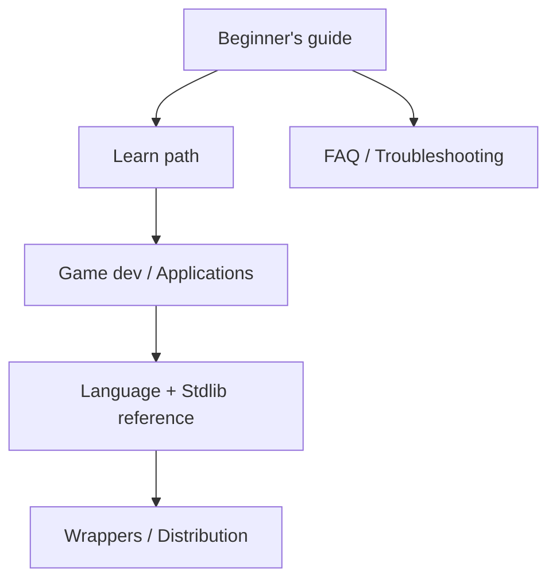

# Koda documentation

**Draw it. Run it. Ship it.**

Koda compiles to a **native binary** — no VM on your players' machines. This hub links every user-facing document.

> New here? Start with the **[Beginner's guide](beginners-guide.md)** (one file) or the **[Learn path](learn/README.md)** (10 short chapters).

---

## Start here

| Document | Best for |
|----------|----------|
| [Beginner's guide](beginners-guide.md) | Complete onboarding in one place |
| [Learn Koda](learn/README.md) | Chapter-by-chapter tutorial |
| [Getting started](guides/getting-started.md) | Install + first commands (quick) |
| [From C](guides/from-c.md) | C/C++ developers migrating |
| [FAQ](faq.md) | Quick answers |
| [Troubleshooting](troubleshooting.md) | When something breaks |
| [Glossary](glossary.md) | Terms and definitions |
| [Concepts](concepts/README.md) | Modules, GC, project layout |

---

## Build something

| Guide | Topic |
|-------|-------|
| [Game development](guides/game-dev.md) | Loops, RNG, timers, cheatsheet |
| [Raylib](guides/raylib.md) | Graphics, input, colors, walkthrough |
| [Applications](guides/applications.md) | CLI tools, files, JSON |
| [Distribution](guides/distribution.md) | `koda bundle`, shipping binaries |
| [Wrappers](wrappers.md) | C/C++ libraries via `kodawrap` |
| [Wrapping libraries](guides/wrapping-libraries.md) | Generate bindings for any C lib |

---

## Reference

| Document | Contents |
|----------|----------|
| [Language reference](../language.md) | Every syntax form (repo root) |
| [Reference index](reference/README.md) | Lookup hub |
| [CLI](reference/cli.md) | Subcommands and `koda.json` |
| [Builtins](reference/builtins.md) | Global functions |
| [Stdlib](stdlib/README.md) | `@math`, `@json`, `@io`, … |
| [commands.md](commands.md) | Extended CLI document |
| [Glossary](glossary.md) | Terms and definitions |

### Stdlib modules

| Module | Doc |
|--------|-----|
| `@math` | [math.md](stdlib/math.md) |
| `@json` | [json.md](stdlib/json.md) |
| `@io` | [io.md](stdlib/io.md) |
| `@array` | [array.md](stdlib/array.md) |
| `@timer` | [timer.md](stdlib/timer.md) |
| `@vec2` / `@vec3` | [vec2](stdlib/vec2.md) · [vec3](stdlib/vec3.md) |
| `@util` | [util.md](stdlib/util.md) |
| `@noise` | [noise.md](stdlib/noise.md) |
| `@str` | [str.md](stdlib/str.md) |

---

## For contributors

| Document | Contents |
|----------|----------|
| [CONTRIBUTING.md](../CONTRIBUTING.md) | Build from source, PRs |
| [positioning.md](positioning.md) | Honest product framing (who Koda is for) |
| [ROADMAP.md](ROADMAP.md) | Prioritized engineering queue |
| [status.md](status.md) | Implementation matrix |
| [MASTER_PLAN.md](MASTER_PLAN.md) | Detailed engineering roadmap |
| [handoff.md](handoff.md) | Compiler pipeline |
| [STYLE-GUIDE.md](STYLE-GUIDE.md) | How we write docs |

---

## Examples in this repository

| Path | Description |
|------|-------------|
| `examples/` | Demos and samples |
| `examples/games/` | Brick breaker, lander, platformer sample |
| `examples/keys.koda` | Raylib key/color constants |
| `examples/release_features.koda` | Feature smoke test |
| `cmd/koda/templates/` | `koda new` templates |

---

## Quick commands

```bash
koda new myapp && cd myapp && koda run
koda run game.koda -- --level 1
koda check ./...
koda lint
koda test -run io_test
koda bench tests/hello.koda --count 3
koda eval 'print(42)'
koda build -o myapp
koda bundle -o dist/myapp
koda doctor
koda help test
```

Install from [GitHub Releases](https://github.com/CharmingBlaze/koda-compiler/releases) with **`stdlib/`** beside the binaries.

---

## Documentation map



---

[Back to repository README](../README.md)
