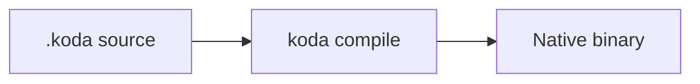

# Koda documentation style guide

This guide defines how we write docs for Koda so they read well **on GitHub**, in **VS Code / Cursor**, in **printed PDFs**, and on **static site generators** (MkDocs, Docusaurus, etc.) without special rendering.

---

## Goals

1. **Findable** — clear titles, predictable paths, linked hub pages.
2. **Scannable** — short sections, tables for comparisons, bullets for lists of facts.
3. **Actionable** — every guide should tell the reader what to do next.
4. **Honest** — document what works today; mark experimental or maintainer-only topics clearly.
5. **Portable** — plain Markdown only; no HTML tricks that break outside GitHub.

---

## File and folder conventions

| Path | Purpose |
|------|---------|
| `README.md` (repo root) | Project pitch, install in one paragraph, link to docs hub |
| `language.md` (repo root) | Complete language reference (lookup, not tutorial) |
| `docs/README.md` | Documentation hub — main table of contents |
| `docs/beginners-guide.md` | Single-file onboarding for new users |
| `docs/learn/` | Chapter-based tutorial path (`01-…`, `02-…`) |
| `docs/guides/` | Task-oriented guides (games, apps, C migration) |
| `docs/stdlib/` | Per-module API reference |
| `docs/reference/` | CLI, builtins index, project manifest |
| `docs/STYLE-GUIDE.md` | This file |

**Naming:** lowercase with hyphens (`game-dev.md`, not `GameDev.md`). Numbered learn chapters use two digits: `01-install.md`.

**One H1 per file.** GitHub uses the H1 as the page title. Do not skip from H1 to H3.

---

## Headings

```markdown
# Page title (H1) — only one per document

## Major section (H2)

### Subsection (H3)

#### Rare detail (H4) — avoid going deeper
```

- H2 = new topic the reader might jump to.
- H3 = detail within that topic.
- Do not use headings for emphasis; use bold sparingly instead.

---

## Links

**Always use relative links** from the file you are editing:

```markdown
See [Game development](guides/game-dev.md).
See [Language reference](../language.md) from `docs/guides/`.
```

**Link text should describe the destination**, not “click here”.

| Good | Bad |
|------|-----|
| [Install Koda](learn/02-install-and-first-run.md) | [here](learn/02-install-and-first-run.md) |
| [stdlib `@math`](stdlib/math.md) | [math](stdlib/math.md) |

External links: full URL, no shortening.

---

## Code blocks

**Language tag:** use `koda` for Koda source, `bash` for shell, `json` for manifests.

```koda
let x = 1;
print(x);
```

```bash
koda run hello.koda
```

**Rules:**

- Complete, runnable examples when possible.
- Show expected output in a separate block or inline after the block.
- Keep examples short; one concept per block.
- Use `...` only when the omitted part is obvious and documented elsewhere.

**Do not** put code fences inside table cells (breaks some renderers). Use a short description in the table and a code block below.

---

## Tables

Use tables for comparisons, command flags, and API summaries.

```markdown
| Command | Purpose |
|---------|---------|
| `koda run` | Compile and run |
| `koda build` | Produce a native executable |
```

- Header row required.
- Align pipes for readability in source (optional but preferred).
- Prefer tables over wide bullet lists when there are 3+ comparable items.

---

## Callouts (portable)

GitHub does not render `:::note` admonitions. Use blockquotes with a bold label:

```markdown
> **Tip:** Use `koda watch` while editing game logic.

> **Note:** Release binaries do not require Go or LLVM on your machine.

> **Warning:** `delete` is a reserved keyword — use `remove` in `io` helpers.
```

---

## Voice and tone

- **Second person** (“you”) for guides; **neutral** for reference.
- **Active verbs:** “Run `koda build`” not “The build command can be run”.
- **Short sentences.** One idea per sentence in procedural steps.
- **Avoid jargon** without a one-line definition; link to [glossary](glossary.md).
- **Case:** Koda (language), `koda` (CLI binary), `.koda` (file extension).

---

## Document templates

### Guide (task-oriented)

```markdown
# Title

One sentence: what this guide helps you do.

**Prerequisites:** links to earlier docs.

---

## Overview

2–3 sentences + optional diagram.

## Steps

### Step 1 — …

## Next steps

| Doc | Why |
|-----|-----|
| … | … |
```

### Reference (API / CLI)

```markdown
# Title

One sentence scope.

## Summary table

| Name | Args | Returns | Notes |

## Details

### `name(args)`

Description. Example. Related links.
```

### Learn chapter

```markdown
# Chapter N — Title

**You will learn:** bullet list.

**Time:** ~10 minutes.

---

## Content sections…

## Try it yourself

Exercise with expected result.

## Next chapter

Link to next file.
```

---

## GitHub vs offline

| Feature | GitHub | VS Code / offline |
|---------|--------|-------------------|
| Relative links | Works | Works |
| Tables | Works | Works |
| `koda` syntax highlight | May fall back to plain | Configure in editor |
| Mermaid | Supported | Supported in many viewers |
| Emoji in titles | Optional | Use sparingly |

**Mermaid** — use only for non-trivial flows (compiler pipeline, game loop). Keep diagrams small.



---

## What not to do

- Duplicate the full language spec in every guide — link to `language.md`.
- Document maintainer internals in user guides — link to `handoff.md` / `CONTRIBUTING.md`.
- Paste 200-line API dumps without structure — split into stdlib pages.
- Use “Fuji”, “Kuji”, or other old product names — the language and CLI are **Koda** / **`koda`** / **`kodawrap`**.
- Commit secrets, tokens, or machine-specific paths as examples.

---

## Review checklist

Before merging doc changes:

- [ ] One H1, logical H2 order
- [ ] All links relative and valid
- [ ] Code examples use `koda` / `bash` fences
- [ ] New pages linked from `docs/README.md`
- [ ] Terminology matches [glossary](glossary.md)
- [ ] “Next steps” or hub link at the end of guides

---

## Updating the hub

When you add a new doc, add one row to the appropriate table in [docs/README.md](README.md). The hub is the single source of navigation — readers should not hunt by filename.
