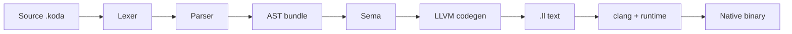

# Koda / Koda compiler architecture

This repository implements **one execution pipeline**: source is lowered to **LLVM IR**, then compiled and linked to a **native executable** with the C runtime (`runtime/src/`, `runtime/libkoda_runtime.a`).

For language syntax and semantics, see [language/syntax.md](language/syntax.md) and [LANGUAGE.md](LANGUAGE.md).

---

## End-to-end pipeline

1. **Loader** — resolves static imports, builds a module bundle (`internal/parser` loaders).
2. **Lexer / parser** — tokens and AST (`internal/lexer`, `internal/parser`).
3. **Semantic analysis** — `internal/sema` (native emit context, optimiser hooks).
4. **Codegen** — `internal/codegen` produces an `*ir.Module` (llir/llvm), serialised to `.ll`.
5. **Native build** — `internal/nativebuild` runs **llc** (optional) and **clang**, links `libkoda_runtime.a`.

CLI commands **`koda run`**, **`koda build`**, and **`koda bundle`** all use this pipeline. `koda run` builds a temporary executable and runs it.

---

## Key packages

| Path | Role |
|------|------|
| `internal/parser` | AST, parse, load / import graph |
| `internal/lexer` | Tokenisation |
| `internal/sema` | Analysis, `PrepareNativeBundle` |
| `internal/codegen` | LLVM IR emission |
| `internal/nativebuild` | llc, clang, link |
| `internal/kodahome` | Toolchain and stdlib path resolution |
| `runtime/src` | C runtime: NaN-boxed values, GC, objects, `koda_*` entry points |

---

## What happened to the bytecode VM?

An early **bytecode VM** under `internal/vm/` was used for quick interpretation during development. It was **removed** from the active tree (2026) so there is only one execution model: **lexer → parser → sema → LLVM codegen → `.ll` → clang → native binary**.

The last in-tree artifact was a small stub (`internal/vm/stub.go`); **full VM sources were not present** in this repository—some older docs still referred to a dual-path layout.

To recover VM-era files from **your** git history (if they ever existed on a branch), run for example:

`git log --all --full-history -- internal/vm/`

The **native LLVM pipeline** is the only supported path. To inspect IR lowering, use **`koda disasm <file.koda>`** (prints LLVM IR text after sema + codegen) or set **`KODA_DEBUG_IR=1`** with **`koda build`** to keep `.KODA_build/main.ll`.

---

## Contributor notes

- LLVM `declare` names in `internal/codegen/runtime.go` must stay aligned with **symbols implemented in** `runtime/src/koda_runtime.c`.
- Wrapper ABI for `// koda:extern` uses `i64 (i32 arg_count, i64* args)` at the LLVM boundary.
